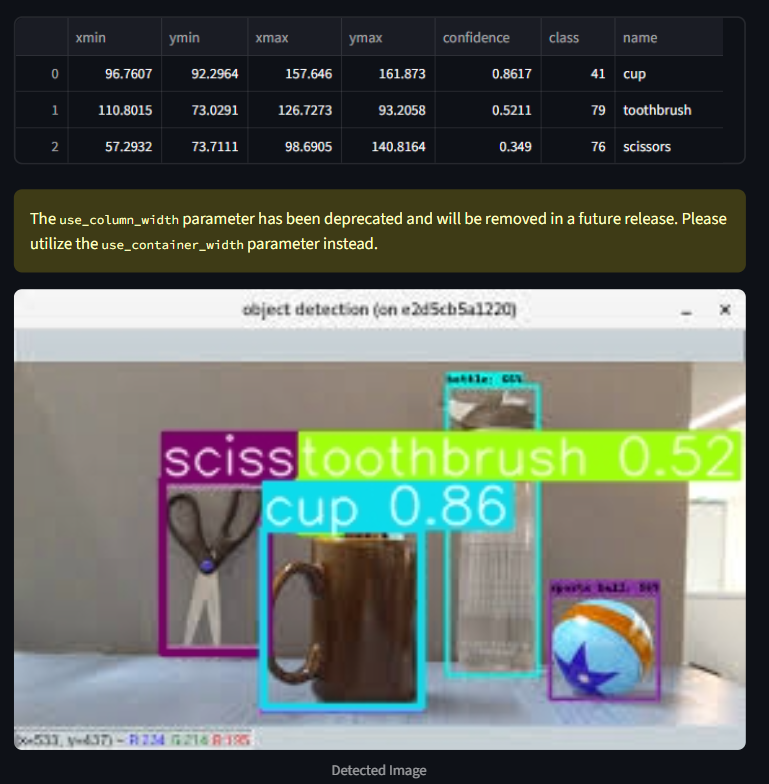
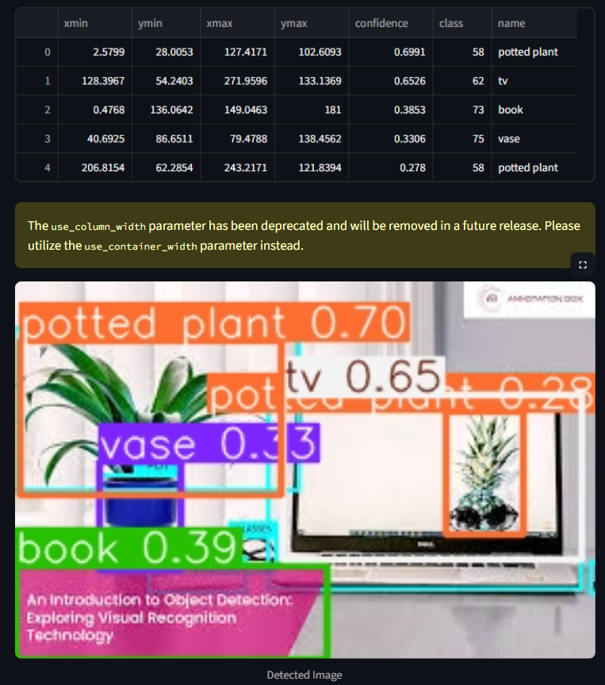
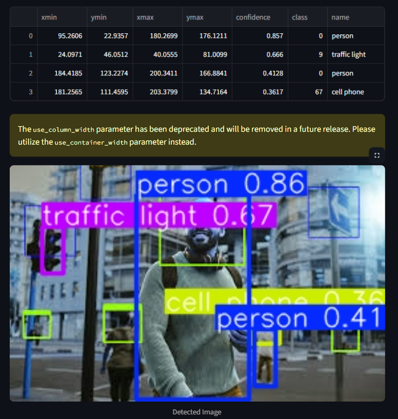

# 🚀 Real-Time Object Detection Web App (YOLOv5 + Streamlit)

> 📷 Upload an image → 🧠 YOLOv5 detects objects → 🌐 View results in your browser

## ✨ Project Highlights

- 🔍 **Object detection** using pre-trained [YOLOv5](https://github.com/ultralytics/yolov5)
- 🖼️ Upload `.jpg/.jpeg/.png` images via a **Streamlit web app**
- 💡 Instantly displays bounding boxes, labels, and confidence scores
- 🌐 Hosted on `localhost` for easy local testing

## 🧠 Tech Stack

| Tool        | Purpose                      |
|-------------|------------------------------|
|  Python   | Programming Language          |
|  PyTorch  | Loads the YOLOv5 model        |
|  OpenCV   | Image reading and decoding    |
|  NumPy    | Array and tensor operations   |
|  Streamlit| Web UI for file upload and display |

---

## 🚀 Quickstart Guide

🔧 1. Clone the Repo
git clone https://github.com/yourusername/rtod-yolov5.git
cd rtod-yolov5

🌱 2. Create a Virtual Environment
python -m venv yolov5env
yolov5env\Scripts\activate      # (Windows CMD)

📦 3. Install Dependencies
pip install streamlit opencv-python torch torchvision torchaudio numpy seaborn

🚀 4. Run the App
streamlit run app.py
Then open http://localhost:8501 in your browser 🚀

## 🔧 Known Limitations & Future Fixes

🚌 Sometimes detects a bus as a car (common in COCO dataset confusion)

⚡ Not yet optimized for performance or large resolution images

🧪 YOLOv5s is the lightest model — might upgrade to yolov5m or yolov5x later

👷‍♀️ This project is a work in progress — I’ll keep improving the detection accuracy and optimizing the model behavior over time.

## 🧾 Sample Output

## ⚡ Future Improvements (Ideas)
🔴 Real-time webcam detection

🎥 Live video stream support (via OpenCV or WebRTC)

© 2025 Rishika Kumari. All rights reserved.

